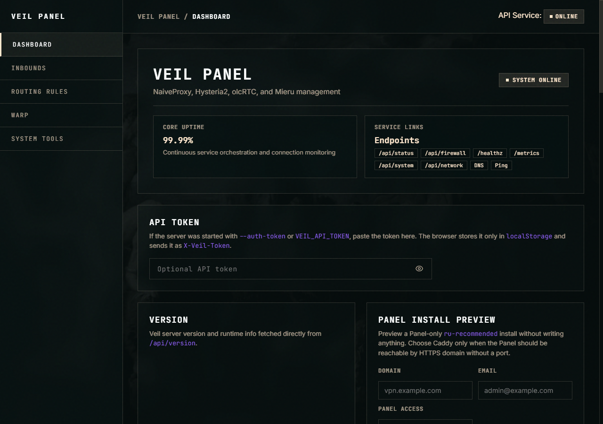

# Veil

Veil is a management panel for NaiveProxy, Hysteria2, olcRTC, and Mieru. It installs the Panel first; proxy Inbounds are added later from the Panel.



## Quick start

One command, answer a few questions, done:

```bash
curl -fsSL https://raw.githubusercontent.com/mikkelchokolate/Veil/main/scripts/install.sh | sudo bash
```

By default Veil can be installed as a **panel-only** control plane. You do not need a domain or Caddy unless you choose Caddy Panel access or add a NaiveProxy Inbound.

After install you'll see either direct/local Panel access over generated self-signed HTTPS:

```text
Panel access: https://127.0.0.1:2096/
```

or, if you choose Caddy Panel access:

```text
Panel URL: https://vpn.example.com/a1b2c3d4e5f6/
```

The HTTPS Panel URL path is randomly generated — only you know it. Direct/local Panel access uses a self-signed certificate, so the browser may ask you to trust it.

### Non-interactive examples

Panel-only local access:

```bash
curl -fsSL https://raw.githubusercontent.com/mikkelchokolate/Veil/main/scripts/install.sh | sudo bash -s -- \
  --panel-access local \
  --yes
```

Panel HTTPS access through Caddy on a domain, without exposing the Panel port:

```bash
curl -fsSL https://raw.githubusercontent.com/mikkelchokolate/Veil/main/scripts/install.sh | sudo bash -s -- \
  --panel-access caddy \
  --domain vpn.example.com \
  --email admin@example.com \
  --yes
```

Protocol runtimes are not selected during install. Open the Panel after install and add NaiveProxy, Hysteria2, or Mieru as Inbounds.

## Inbounds

Open the Panel and add Inbounds for the protocols you need:

| Protocol | Transports | Notes |
|---|---:|---|
| NaiveProxy | TCP | Requires Caddy, domain, email, username, and password |
| Hysteria2 | UDP | Does not require Caddy |
| olcRTC | UDP | Does not require Caddy |
| Mieru | TCP or UDP | Does not require Caddy |

TCP and UDP can use the same numeric port at the same time. For example, `mieru tcp 443` and `mieru udp 443` are different transport bindings and can coexist.

Passwords are auto-generated when omitted. You can replace them in the Panel.

## What you get

After panel-only install, Veil runs:

| Service | What |
|---|---|
| `veil.service` | Web Panel + API |

When you add and apply Inbounds, Veil can also manage:

| Service | What |
|---|---|
| `veil-naive.service` | NaiveProxy via Caddy |
| `veil-hysteria2.service` | Hysteria2 |
| `veil-olcrtc.service` | olcRTC |
| `veil-mieru.service` | Mieru |

All secrets are stored encrypted at rest.

## Manage

```bash
veil status
veil version --check
veil update --yes --staged
veil uninstall --yes
```

### Backup, rollback, and audit

Repair can write backups and a JSONL audit log. The backup directory must be writable; audit entries are not written during `--dry-run`.

```bash
veil repair --backup-dir /var/lib/veil/backups --audit-log /var/log/veil/audit.jsonl --yes
veil rollback list --backup-dir /var/lib/veil/backups
veil rollback restore <backup-id> --backup-dir /var/lib/veil/backups --yes
veil rollback cleanup <backup-id> --backup-dir /var/lib/veil/backups --yes
```

## Security

- **API token** — required for all management operations when exposed
- **HTTPS Panel access** — generated self-signed Panel TLS without Caddy, or Caddy with random Web base path
- **Encryption** — secrets encrypted with AES-256-GCM (`/etc/veil/state.key`)
- **TLS 1.2+** — when HTTPS is enabled
- **Rate limiting** — protects expensive endpoints
- **Input validation** — all API inputs validated

## Docker

```bash
docker run -d --name veil --network host \
  -v veil-state:/var/lib/veil -v veil-etc:/etc/veil \
  veil-panel/veil:latest serve
```
